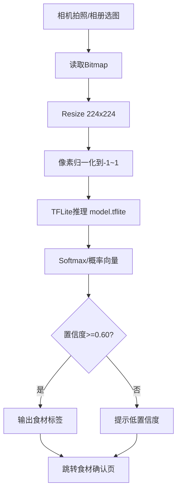
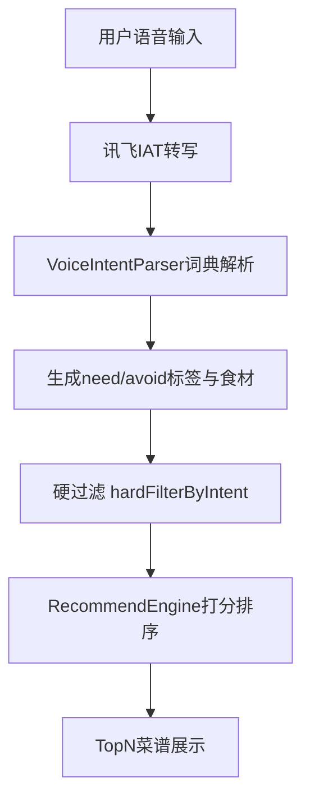
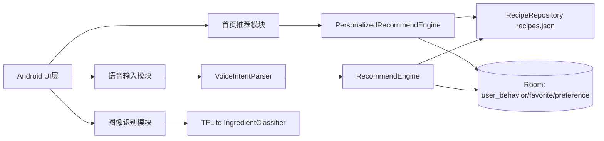

# 论文可直接使用：核心功能模块阐述（按当前项目代码）

> 适用章节：第4章“核心算法设计”与第5章“系统实现”。
> 说明：以下内容严格依据当前代码实现整理；其中“数据集外部来源”在代码中未保存出处元数据，建议你按真实采集过程补齐文献或平台引用。

---

## 1. 中餐数据集构建与标注（可放 4.1 / 4.2）

### 1.1 数据来源与组织形式
系统主食谱数据以本地静态资产形式存储在 `assets/recipes.json`，启动后通过 `RecipeRepository` 一次性解析为 `List<Recipe>`，用于搜索、推荐、语音筛选与食材反查。

- 数据文件：`app/src/main/assets/recipes.json`
- 读取方式：Gson + TypeToken 反序列化
- 字段结构（每条食谱均包含）：
  - `id`
  - `name`
  - `ingredients`
  - `steps`
  - `tags`
  - `minutes`
  - `calorie`

### 1.2 数据规模（代码可复现）
当前版本数据规模如下：

- 食谱总数：**50** 条
- 平均标签数：**2.56** / 菜
- 平均食材数：**4.24** / 菜
- 字段完备率：以上 7 个核心字段在 50 条样本中全部出现

> 可在论文写法中描述为“小规模高质量结构化中餐食谱集”，适配移动端本地推荐与快速迭代验证。

### 1.3 标注方法（结构化与语义双标注）
本项目数据标注属于“规则可计算标注”，核心体现在：

1. **属性标注**：以 `minutes`（烹饪时长）、`calorie`（热量）作为可量化排序特征；
2. **语义标注**：以 `tags` 承担口味/饮食目标语义（如“低脂”“高蛋白”“微辣”等）；
3. **食材标注**：以 `ingredients` 提供食材粒度检索与推荐匹配。

此外，识别模型标签在 `labels.txt` 中单独维护，用于图像识别输出类别标准化。当前标签数为 **14 类**（如番茄、鸡蛋、土豆、豆腐等）。

---

## 2. 图像识别模块（可放 4.3 + 5.2.x）

## 2.1 实际模型与输入输出定义
当前工程中采用 TensorFlow Lite 分类模型（`model.tflite`），由 `IngredientClassifier` 在端侧推理。代码未体现 ResNet50+CBAM 结构定义，因此论文应写为：

- **当前实现**：轻量 TFLite 食材分类器（端侧部署）
- **输入尺寸**：`224×224×3`
- **归一化**：`(pixel - 127.5) / 127.5`，映射到 `[-1,1]`
- **输出形式**：`float[1][num_labels]`，取最大概率类别
- **结果阈值**：在界面层设置 `CONF_THRESHOLD = 0.60`

> 如果导师要求“ResNet50+CBAM 改进细节”，建议将其写成“拟采用/对比实验模型”，并与本实现（TFLite 部署模型）明确区分，避免与代码不一致。

### 2.2 图像预处理流程（对应代码实现）
当前已落地的预处理为：

1. 从相机或相册获取 Bitmap；
2. 缩放至 224×224；
3. 逐像素提取 RGB；
4. 归一化到 [-1,1]；
5. 组装 ByteBuffer 输入模型；
6. 推理并输出 top-1 结果；
7. 置信度低于 0.60 时提示用户“换图或补充样本”。

> 说明：代码中**尚未实现显式去噪/直方图增强/白平衡校正**。论文可写“当前版本采用基础缩放与归一化，后续可引入去噪与增强提升鲁棒性”。

### 2.3 图像识别流程图（Mermaid）


### 2.4 核心伪代码（图像分类）
```text
function classify(bitmap):
    img = resize(bitmap, 224, 224)
    input = ByteBuffer(224*224*3*4)
    for p in img.pixels:
        r,g,b = RGB(p)
        input.put((r-127.5)/127.5)
        input.put((g-127.5)/127.5)
        input.put((b-127.5)/127.5)

    output = tflite.run(input)
    bestIdx = argmax(output[0])
    return labels[bestIdx], output[0][bestIdx]
```

---

## 3. 语音识别与语义理解模块（可放 4.4 + 5.2.x）

### 3.1 语音识别链路
语音输入采用讯飞 IAT v2 WebSocket 流式识别：

- 采样率：16kHz
- 声道：单声道 PCM 16bit
- 分帧策略：40ms/帧（约 1280 bytes）
- 状态帧：`status=0` 首帧，`1` 中间帧，`2` 结束帧

识别结果包含增量文本与最终文本，最终文本进入意图解析。

### 3.2 语义解析（规则型 NLU）
`VoiceIntentParser` 采用“领域词典 + 否定词窗”方法：

1. 在标签词典中识别偏好标签（如低脂、高蛋白、清淡、微辣）；
2. 在食材词典中识别“想要/不要”食材；
3. 若关键词左侧 4 字窗口命中“不要/不吃/过敏/忌口”等否定词，则归入 avoid 集合；
4. 特例规则：`不要辣/不吃辣` 统一映射为 `avoidTags += 微辣`。

### 3.3 语音推荐流程图


---

## 4. 用户学习推荐算法（重点，可放第4章）

### 4.1 行为反馈量化
系统通过 `user_behavior` 表记录行为，再由 SQL 聚合为每道菜的反馈统计：

- 浏览次数：`cnt = SUM(actionType='VIEW')`
- 收藏增量：
  - 收藏记 `+1`（`FAVORITE, keyword='1'`）
  - 取消收藏记 `-1`（`FAVORITE, keyword='-1'`）
- 评分偏移：`ratingDelta = SUM(RATE值 - 3)`（以 3 星为中性）
- 浏览总时长：`totalViewDuration = SUM(VIEW_DURATION秒数)`

### 4.2 混合推荐打分函数（与代码一致）
针对用户 \(u\) 和菜谱 \(i\)，综合分定义为：

\[
\begin{aligned}
Score(u,i)=&\ 1
+ 5\cdot TasteMatch(u,i)
+ 6\cdot DietMatch(u,i)
+ 4\cdot CommonIngMatch(u,i) \\
&-100\cdot AllergyHit(u,i)
+ 2\cdot ViewCnt(u,i)
+ 8\cdot FavoriteDelta(u,i) \\
&+ 5\cdot RatingDelta(u,i)
+ \min\left(8,\left\lfloor\frac{ViewDuration(u,i)}{120}\right\rfloor\right)
+ 8\cdot IsFavorite(i) \\
&+ \frac{\max(0,30-Minutes_i)}{10}
+ \frac{\max(0,800-Calorie_i)}{200}
\end{aligned}
\]

其中：

- 前四项对应**冷启动偏好建模**；
- 中间四项对应**行为学习反馈**；
- 末两项对应**轻量健康/效率先验**（快手、低热量）。

### 4.3 推荐逻辑分层（工程实现）
系统采用“先过滤、后排序”的混合策略：

1. **硬约束过滤层**（语音场景）：
   - 命中 avoid 食材或 avoid 标签直接剔除；
   - 若用户明确提出 need 食材，则至少命中一个才保留；
2. **软评分排序层**：
   - 在候选集上应用加权得分，输出 Top-N。

该设计兼顾“可控性”（满足用户硬条件）与“个性化”（行为学习动态调整）。

### 4.4 推荐算法伪代码
```text
function recommend(allRecipes, preference, behaviorStats, favoriteIds, topN):
    for recipe in allRecipes:
        score = 1

        # 冷启动偏好
        if taste match: score += 5
        if diet match: score += 6
        if common ingredient match: score += 4
        if allergy hit: score -= 100

        # 行为反馈
        stat = behaviorStats[recipe.id]
        if stat exists:
            score += 2 * stat.view_cnt
            score += 8 * stat.favorite_delta
            score += 5 * stat.rating_delta
            score += min(8, stat.total_view_duration / 120)

        if recipe.id in favoriteIds: score += 8

        # 先验项
        score += max(0, 30 - recipe.minutes) / 10
        score += max(0, 800 - recipe.calorie) / 200

        push(scoredList, (recipe, score))

    sort scoredList by score desc
    return topN items
```

### 4.5 模块架构图（可放系统设计章节）


---

## 5. 可直接放入论文的“改进说明”段落

可在“4.x 小结”中加入以下表述：

1. 当前工程已实现**端侧可运行闭环**：数据读取→偏好建模→行为学习→排序输出；
2. 当前图像模块采用 TFLite 轻量分类，已覆盖移动端实时识别需求；
3. 为满足更高识别精度，可在后续版本引入“ResNet50+CBAM 主干 + 注意力增强 + 数据增强训练”，并导出 TFLite 部署；
4. 当前预处理以缩放+归一化为主，后续可加入中值滤波、CLAHE、颜色恒常化等增强策略；
5. 当前推荐采用可解释加权模型，后续可扩展时间衰减、上下文感知（时段/季节）与轻量深度排序。

---

## 6. 导师意见逐条对应说明（可附录）

- **“必须详细阐述中餐数据集来源、规模、标注方法”**：见本文第1节；
- **“图像预处理步骤（去噪、增强）”**：见第2.2节，并明确“当前实现与后续增强”；
- **“识别模型（如ResNet50+CBAM）及改进细节”**：见第2.1与第5节，区分“已实现模型”与“可扩展模型”；
- **“用户行为反馈量化公式、混合推荐实现逻辑”**：见第4.1~4.4节；
- **“UI截图移至实现/测试章节”**：建议将截图仅放第5章或第6章，用于功能演示，不替代算法说明。
